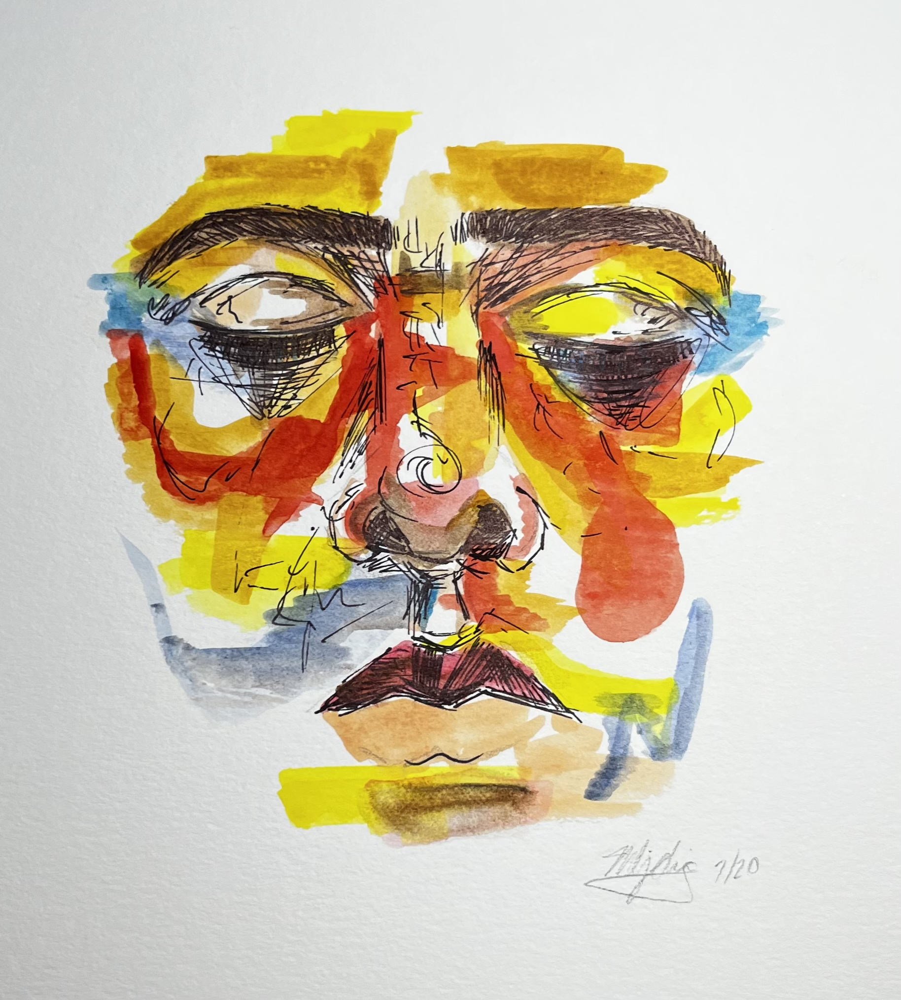
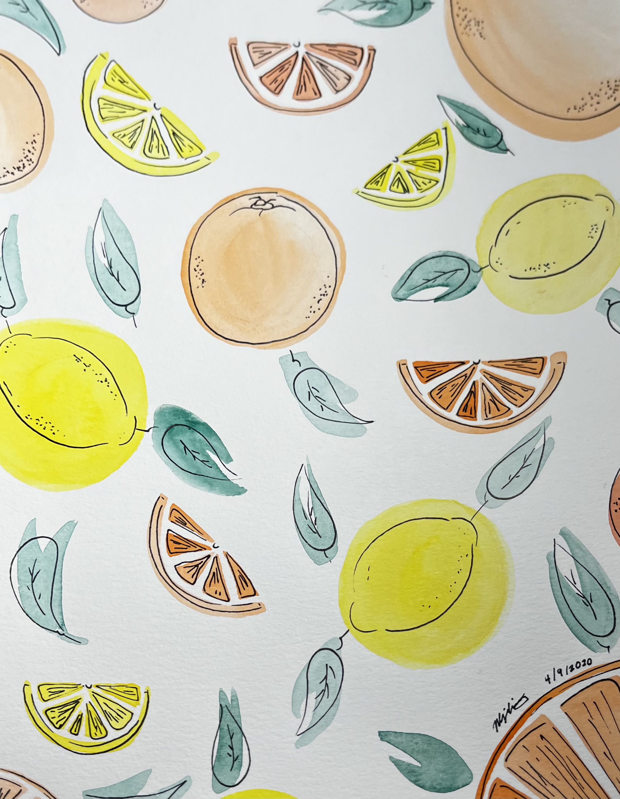

# H O M E

**Maria-Louisa Ching**

*User Experience and Interface Design Major*

College of Media Arts and Design

## A B O U T  M E
**Professional**

I am an undergraduate student at Drexel University with a love for creativity, the mind, and human behavior through technology. I am currently a User Experience & Interface Design (UXID) major with a minor in Psychology. 
Drexel University requires students to participate in a 6-month cooperation education program known as “Co-Op”. It creates opportunities for students like myself to gain professional work experience in International, Research, or Entrepreneurship settings. I will be available to work for my next Co-Op cycle in April of 2024 to August of 2024. 

**Personal**

*My Story...*

I found out about Drexel’s User Experience and Interactive Design program during my first co-op at Comcast Corporation when I used to be a psychology major. In the Comcast Technology Center, there is an exhibition called The Universal Sphere where the public can go through a fun and interactive cinematic experience. I was told that UXID co-ops helped work on this exhibit and wanted to know more. After extensive research and talking to many staff at the Antoinette Westphal College of Media Arts and Design, I took a gap semester and officially changed my major. 
I am a first generation college student, born and raised in Northeast Philadelphia! I grew up in a Chinese-Filipino household as the middle child. 
Outside of my academic and professional life, I pursue many hobbies such as painting, reading, taking pictures, enjoying nature, and exploring the city of Philadelphia! I’m also a huge foodie and love to try new foods. 

## R E S U M E
**EDUCATION**

**Drexel University**

September 2021 - June 2027 | Philadelphia, PA

Bachelor of Science in User Experience & Interface Design

GPA: 3.41

**EXPERIENCE**

**W.W. Hagerty | Philadelphia, PA**

Library Integrated Technology Assistant | October 2021 - July 2022
* Assist staff and library patrons with computer-related complications
* Implement project plans based on meta-literacy skills
* Update computer equipment and electronic devices 

**Comcast Corporation**

Co-Op, Corporate DE&I Public Policy | September 2022 - March 2023 
* Assist in analysis and recommendations on policy challenges 
* Collect, draft, and analyze feedback from key stakeholders
* Provide administrative and project management support 

**Moshulu Restaurant | Philadelphia, PA**

Hostess | April 2023 - Present
* Answer telephones, confirm reservations, show guests to tables
* Deliver accurate messaging to both guests and teammates
* Maintain accurate knowledge of facility information 

**ACIVITIES**

**Ambassador | Drexel Student Ambassador Program**
January 2023 - Present

**Editor | Psi Chi Magazine**
April 2022 - Present

## P O R T F O L I O
**Paintings** 

 
Ching, Maria-Louisa. 2021. Watercolor on paper. 

Ching, Maria-Louisa. 2021. Watercolor on paper. 

Ching, Maria-Louisa. 2021. Watercolor on paper. 

 
Ching, Maria-Louisa. 2021. Watercolor on paper. 

**Photography**

 
Ching, Maria-Louisa. 2023. iPhone XR camera.

 
Ching, Maria-Louisa. 2023. iPhone XR camera.

 
Ching, Maria-Louisa. 2023. iPhone XR camera.

  
Ching, Maria-Louisa. 2023. iPhone XR camera.

## C O N T A C T  I N F O 
**LinkedIn**
 

**Emails**
* mjc498@drexel.edu
* mlching87@gmail.com 